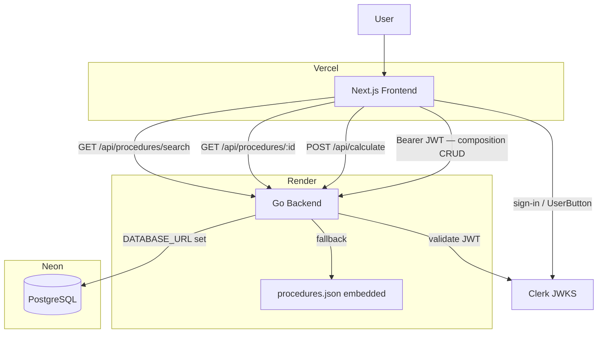

# Synvera Architecture

## Overview

Synvera is a deterministic medical procedure pricing platform built around the correct **SBN 1:N CBHPM** domain model. One SBN surgical package maps to multiple CBHPM billable codes. Physicians select which codes were performed, declare the access route type, and receive a real-time breakdown applying validated CBHPM 2022 billing rules.

See [domain-model.md](domain-model.md) for the full domain concepts, ER diagram, and calculation rules.

The system is composed of:

- Next.js frontend (Vercel)
- Go backend (Render)
- Embedded procedure catalog (procedures.json, fallback)
- PostgreSQL via Neon (production data layer)
- **Clerk** — authentication provider (v2.4.0)

## High-Level Architecture



## Frontend Routes (v2.6.0+)

| Route | Auth | Description |
|---|---|---|
| `/` | Optional | Workspace home. Authenticated: greeting, recent compositions, quick-tools grid, release notes. Unauthenticated: minimal branded entry screen with sign-in button. |
| `/novo-calculo` | Optional | Calculation entry. Search tab (procedure autocomplete → `/procedure`) and Minhas Composições tab (list, reload, delete). |
| `/procedure?sbn=…` | Optional | Procedure detail + composition builder + valuation. Compositions require auth to save. |
| `/procedure?composition=…` | Optional | Load a saved composition into the procedure page. |
| `/share?…` | No | Read-only professional report. Reconstructs calculation state from URL params. |

> `/` is the physician workspace, not a marketing landing page. The search-first experience lives at `/novo-calculo`.

---

## Components

### Frontend

Responsibilities:

- Search SBN procedures (debounced, accent-insensitive)
- Display all associated CBHPM codes with checkboxes; porte is read-only (intrinsic to the code)
- Access route selection (same vs different — drives CBHPM 4.1/4.2 discount)
- Auxiliary count selector (0–4) and anesthesia toggle
- Real-time valuation as composition changes (debounced 150 ms)
- Detailed breakdown: principal procedure, discount rule, per-auxiliary fees (CBHPM 5.1: 60/40/30/30%)
- Save and manage reusable surgical compositions (POST/PUT/DELETE `/api/compositions`)
- Share a calculation via URL-encoded params — opens the Premium Sharing report page
- Render the Premium Sharing report page: professional read-only medical report with per-value explanations, print support, and Open Graph metadata

### Backend

Responsibilities:

- Search SBN procedures (text + code + description match)
- Return procedure detail with all mapped CBHPM codes
- Execute multi-code billing calculations (pure functions, no I/O)
- Environment-aware: Neon if `DATABASE_URL` is set, embedded JSON otherwise

### Data Layer

Responsibilities:

- Store the SBN → CBHPM 1:N mapping catalog (Neon/PostgreSQL)
- Provide fallback catalog via embedded `procedures.json`
- Store porte values (seeded via migration 002)

## Authentication (v2.4.0)

### Provider

**Clerk** is the authentication provider. It handles identity (Google OAuth, email magic link), session management, and JWT issuance. Synvera does not store passwords or issue its own tokens.

### Flow

1. The physician signs in via Clerk (hosted modal, `<SignInButton>`).
2. Clerk issues a short-lived RS256 JWT (session token).
3. The frontend calls `useAuth().getToken()` and attaches `Authorization: Bearer <token>` to every composition API request.
4. The Go backend validates the JWT against Clerk's JWKS endpoint (`CLERK_JWKS_URL`), verifies the issuer (`CLERK_ISSUER`), and verifies expiration. Unsigned or expired tokens are rejected with 401.
5. The `sub` claim (Clerk user ID) is used to look up or create a row in `physician_accounts` via `FindOrCreatePhysician`.
6. The physician's internal UUID is injected into the request context. All composition queries are scoped by this UUID.

### Scope boundary

| Route | Auth required |
|---|---|
| `GET /api/procedures/search` | No |
| `GET /api/procedures/:id` | No |
| `POST /api/calculate` | No |
| `GET /api/health` | No |
| `/share?…` (shared report page) | No |
| `POST /api/compositions` | Yes |
| `GET /api/compositions` | Yes |
| `GET /api/compositions/:id` | Yes |
| `PUT /api/compositions/:id` | Yes |
| `DELETE /api/compositions/:id` | Yes |

### `physician_accounts` table

Maps a Clerk identity to an Synvera physician record. `FindOrCreatePhysician` upserts on `clerk_user_id`, ensuring exactly one internal UUID per Clerk account.

```
physician_accounts
  id            UUID PK (gen_random_uuid())
  clerk_user_id TEXT UNIQUE NOT NULL   — JWT sub claim
  email         TEXT                   — populated from Clerk profile (optional)
  name          TEXT                   — populated from Clerk profile (optional)
  created_at    TIMESTAMPTZ
  updated_at    TIMESTAMPTZ
```

### Out of scope for v2.4.0

Subscriptions, billing, organizations, teams, roles, admin dashboard, and multi-tenant clinics are explicitly not implemented.

---

## Backend Package Layout

```
backend/
  cmd/api/main.go          entry point; env-aware repo selection
  internal/
    config/                reads DATABASE_URL + PORT + CLERK_* env vars
    models/                domain types (incl. PhysicianAccount)
    repository/            interface + file + postgres implementations
    service/               pure calculation functions
    handlers/              HTTP handlers + routes + Clerk JWT middleware
    generated/             openapi.gen.go (hand-maintained, matches openapi.yaml)
  db/
    migrations/            001–010 (009: physician_accounts, 010: compositions FK)
    query.sql              canonical SQL for PostgresRepository
```

## Premium Sharing (v2.3.0)

The shared calculation page (`/share?sbn=…&codes=…&a=…&an=…&route=…`) is a read-only professional report designed for distribution to other surgeons, assistants, hospitals, auditors, and administrative teams.

### Design constraints

- **Read-only**: no edit controls, no dark mode toggle, no composition save.
- **Actions**: "Copiar link" (clipboard) and "Imprimir relatório" (`window.print()`).
- **No PDF generation**: intentionally out of scope for v2.3.0. Print-to-PDF via the browser is the supported path.
- **Print CSS**: `.no-print` hides actions and navigation; `.total-print` / `.total-screen` swaps the dark total section for a print-safe light version; `break-inside: avoid` on each section.
- **Open Graph metadata**: served from `app/share/layout.tsx` (server component) with generic title/description since procedure name is not available server-side.
- **"Como foi calculado"**: per-value explanation blocks for surgeon value, auxiliaries, anesthesiologist, and team total — each derived directly from the live calculation result.

### URL format

The share URL is built entirely client-side by the procedure page and contains all parameters needed to reconstruct the calculation without a database lookup:

```
/share?sbn={sbn_id}&codes={cbhpm1},{cbhpm2}&a={aux_count}&an={0|1}&route={same|different}
```

Existing shared links continue to work without change.

### Future clean URLs (deferred)

`/share/{public_id}` requires persisting the share event to the `calculations` table and a new backend route. Deferred post-v2.3.0.

---

## Valuation Engine

The calculation service (`internal/service/calculator.go`) is a pure function with no I/O. It implements:

### Principal procedure selection

The code with the highest monetary porte value is designated the principal.

### Multi-procedure discounting (CBHPM 2022, items 4.1 / 4.2)

| Access route | Formula |
|---|---|
| `same` (4.1) | `principal_value + 0.50 × Σ(additional values)` |
| `different` (4.2) | `principal_value + 0.70 × Σ(additional values)` |
| Single code | `100% of porte value` (no discount) |

### Auxiliary surgeon fees (CBHPM 2022, items 5.1 / 5.2)

Applied to the final surgeon value (after discounting), not to `total_base`.

| Position | Rate |
|---|---|
| 1st auxiliary | 60% |
| 2nd auxiliary | 40% |
| 3rd auxiliary | 30% |
| 4th auxiliary | 30% |

### API contract (openapi.yaml v3.0.0)

`POST /api/calculate` now requires `access_route_type: "same" | "different"` and returns:
- `surgeon_breakdown` — step-by-step derivation
- `individual_auxiliary_fees` — per-position fee with percentage
- `code_breakdown[].is_principal` — flags the principal code