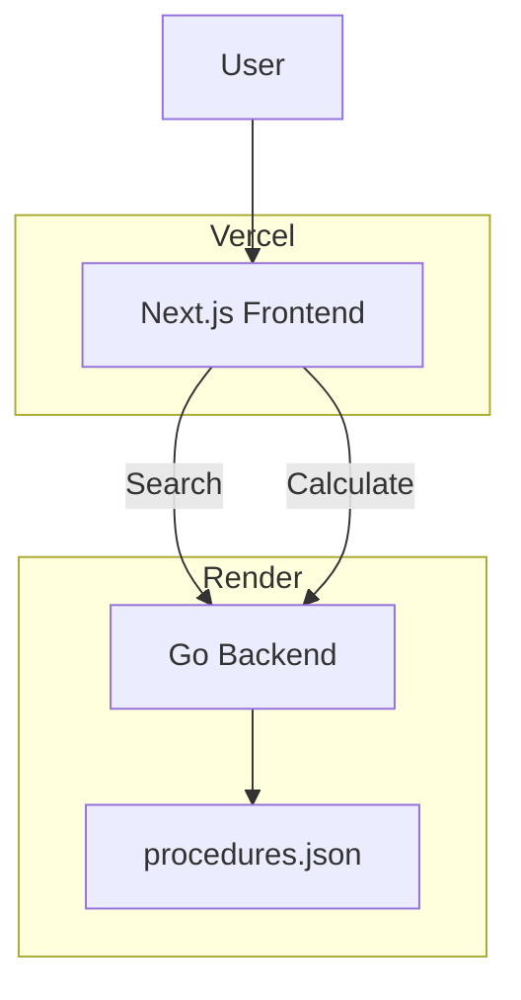

# ProcediPriz Architecture

## Overview

ProcediPriz is a deterministic medical procedure pricing platform.

The system is composed of:

- Next.js frontend
- Go backend
- Embedded procedure catalog (procedures.json)
- Vercel hosting
- Render hosting

## High-Level Architecture

## Components

### Frontend

Responsibilities:

- Search procedures
- Display results
- Share calculations
- Consume API

### Backend

Responsibilities:

- Search procedures
- Execute pricing rules
- Return final value

### Data Layer

Responsibilities:

- Store procedure catalog
- Provide pricing inputs