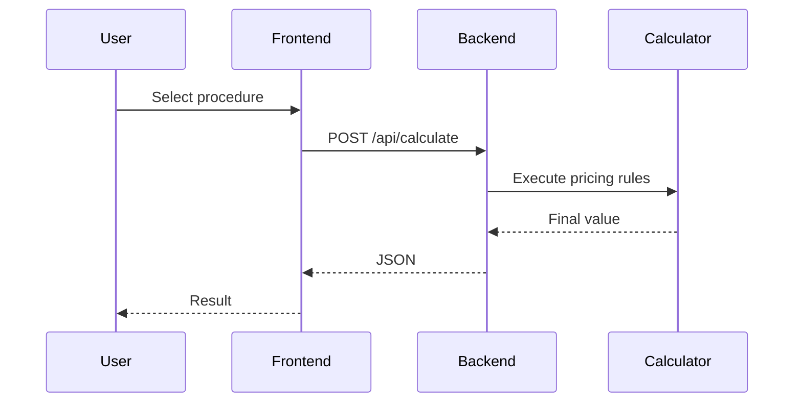

# Calculation Flow

```mermaid
sequenceDiagram

    participant User
    participant Frontend
    participant Backend
    participant Calculator

    User->>Frontend: Select procedure

    Frontend->>Backend: POST /api/calculate

    Backend->>Calculator: Execute pricing rules

    Calculator-->>Backend: Final value

    Backend-->>Frontend: JSON

    Frontend-->>User: Result
```

## Business Inputs

- Procedure
- Surgical assistants
- Anesthesia
- Procedure size (porte)

## Output

- Final procedure value