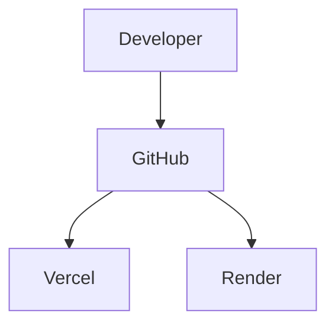

# Deployment

## Frontend

- Next.js
- Vercel

## Backend

- Go
- Render

## CI/CD

- GitHub
- Automatic deployments

## Environments

Local, development, staging and production are kept strictly separated to keep
experimental data out of production. See
[Database Environments](deployment/database-environments.md) for the full
reference (env templates, guardrails, controlled commands, and the
Neon/Render/Vercel configuration).