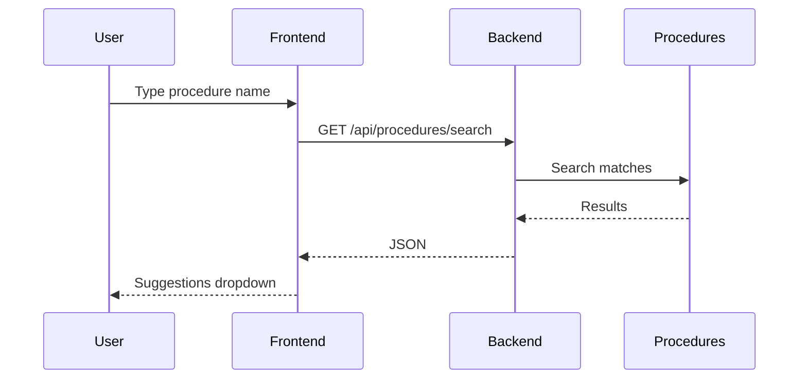

# Search Flow

```mermaid
sequenceDiagram

    participant User
    participant Frontend
    participant Backend
    participant Procedures

    User->>Frontend: Type procedure name

    Frontend->>Backend: GET /api/procedures/search

    Backend->>Procedures: Search matches

    Procedures-->>Backend: Results

    Backend-->>Frontend: JSON

    Frontend-->>User: Suggestions dropdown
```